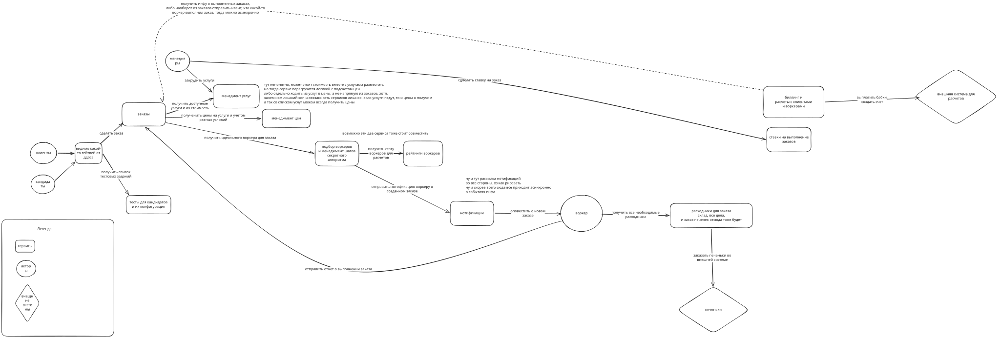

# Структура системы  

  

# Описания, почему были выбраны те или иные решения:  
## Почему была выбрана именно такая структура (монолит, сервисы или микс)?
Выбрал микросервисную архитектуру, потому что:  
- есть требования по быстрому ТТМ, а в монолите это может быть сложновато
- так же есть требования по тестированию гипотез, что предполагает частые релизы, с монолитом сложнее в этом плане
- с другой архитектурой не работал, а если и работал, то скорее это был распределенный монолит. Возможно, у меня такой же получился. Но в любом случае с монолитными проектами было всегда сложновато работать

## Почему были выбраны именно такие части системы, которые вы выбрали?  
Постарался разбить всю систему на логические части из требований. Просто читал требования и выписывал сущности, которые там упоминались. При попытке их объединить, понял, что все сущности хоть и связаны, но являются самостоятельными частями системы. Следовательно менеджить их всех удобнее будет в разделенных сервисах, чтобы не смешивать все домены разом. Так и поддерживать будет удобнее...наверное.

## Почему были выбраны именно такие коммуникации (если это не один большой монолит)?  
Над коммуникациями не задумывался особо. Были мысли о только о том, что каждый сервис может испускать асинхронно событие о том, что что-то произошло, а сервис нотификаций будет подписан на эти сервисы и соотвественно отправлять нотификации тем, кому нужно.

Так же в процессе подумал о сервисе выплат и балансов: он либо раз в какое-то время будет синхронно ходить за инфой о выполненных заказах и выполнять расчеты. Либо же будет подписан на события о выполнении заказов определенным воркером для определенного пользователя, что мне сейчас кажется более естественным, хотя нагрузки особой нет никакой по условиям и мы можем себе позволить обрабатывать данные пачками.

Плюс у нас по условиям можно не думать о бабках, что тоже намекает на то, что можно наплодить всяких брокеров, чтобы развязать сервисы друг от друга в угоду устойчивости всей системы к сбоям.

Нагрузки большой нет, так что я думаю, что можно не использовать асинхронные коммуникации в остальных частях системы. Так же на самом деле нет никаких требований к отказоустойчивости системы, поэтому пытаться развязать сервисы между собой асинхронными коммункациями - скорее интуитивное желание или даже просто привычка, потому что такие требования есть почти всегда.

В целом все мысли о коммуникациях, глубоко не погружался в эту тему, ибо за время на нулевое дз уйду)

## Опишите спорные места и (или) места, которые вам кажутся критичными на данный момент.  
Описал на диаграмме и собственно в предыдущем пункте. 

Мне еще не нравится, что сервис заказов сам по себе начинает выглядеть как некий гейтвей, который ходить в остальные сервисы. И если он шлепнется, то шлепнется почти вся система. 
