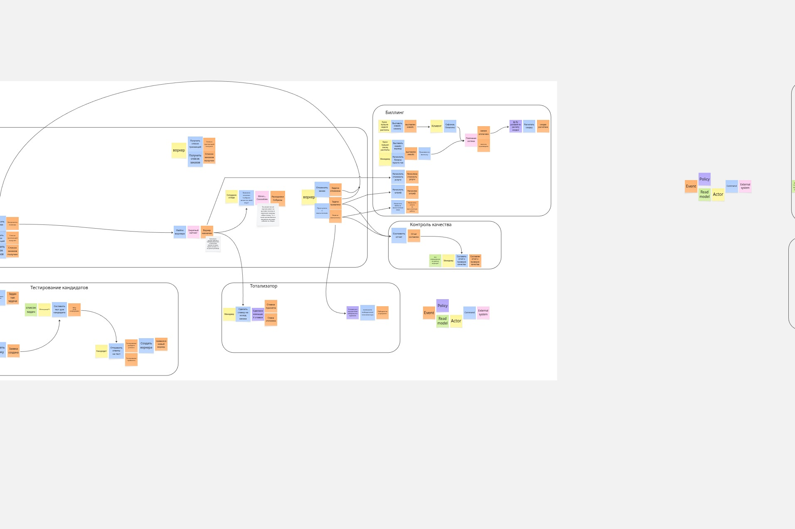

# Event Storming
  
  

# Текстом опишите логику, по которой сгруппировали команды и события в контексты.
Взглянул на готовую схему и как-то сразу прорисовались основные зоны:
- заказы
- что-то связанноe с начислением/списанием средств
- мелкие кусочки не туда и не сюда: тотализатор и контроль качества
- процесс появления новых воркеров

и оставалось определить только границы этих областей. Если с воркерами было все понятно: пришел новый кандидат и его путь кандидата заканчивается тогда, когда он сдал тесты (не важно с каким результатом). Ну и в целом этот модуль можно спокойно отделить от системы и он сможет работать отдельно: определять может ли кандидат быть воркером или нет? Т.е. самостоятельно может быть какой-то единицей, которая приносит пользу - значит самостоятельный контекст.

возник вопрос: а где заканчивается заказ? когда воркер перевел в его конечный статус? написал отчет? проведен анализ качества выполненной услуги? Решил примерно так же, что заказы могут свободно прожить без анализа качества, значит это можно вынести в отдельный модуль.

сложнее было формализовать историю с выплатами и штрафами. Интуитивно казалось, что должна быть какая-то система с балансом воркеров и пользователей, а выплаты производились бы с помощью внешнего провайдера. Поэтому решил упростить и вынести всю эту историю в отдельный контекст от заказов, т.к. по моей растерянности стало ясно, что это явно должно быть чем-то отдельным, потому что если заказы для меня более менее привычны, то биллинг может иметь кучу ньюансов как доменных так и технических - значит в отдельный контекст дорога, возможно для отдельной команды.

Ну и тотализатор. Мелкий кусок, который часто будет меняться. И его наличие никак не влияет на логику заказов. Так же у нас есть пункт в требованиях, что бизнес часто хочет тестировать гипотезы, а эта часть будет меняться редко - логично вынести ее в отдельный контекст и забыть.

# Модель данных

# Модель коммуникаций
