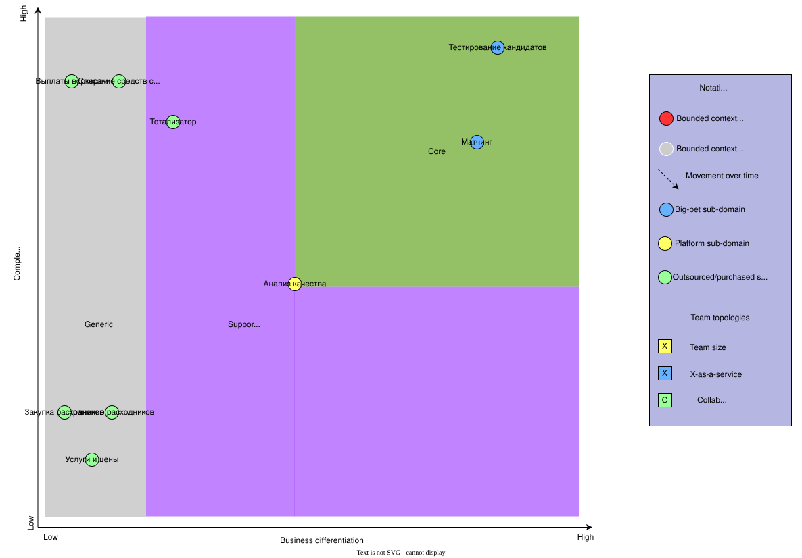
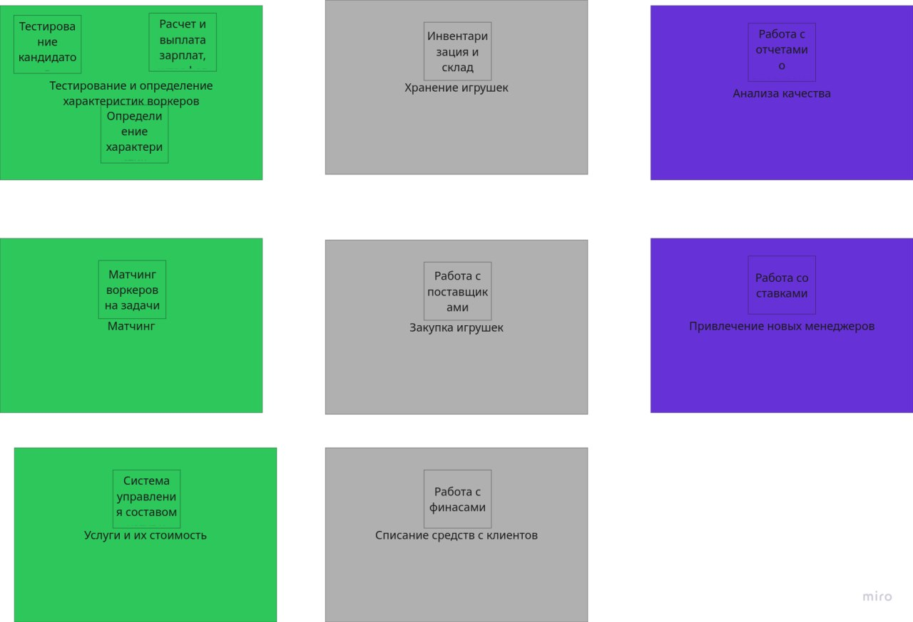
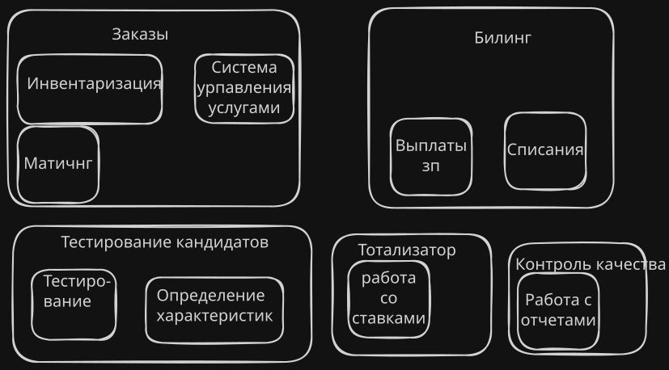
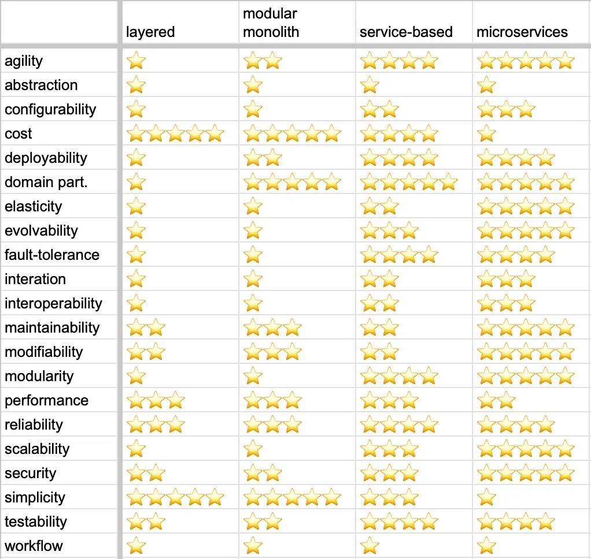

# Сделать core domain chart (после прочтения урока поймёте)
Главная проблема, которую решает Make Cats Free Again, — проблема усталости котов-тестировщиков после рабочей смены по тестированию устройств.
Компания помогает котам-тестировщикам выполнять их привычные дела по тыдыгыканью с помощью делегирования
этих задач лучшим представителям породы, тем самым разгружая котов-тестировщиков от бытовой рутины.

## Начинайте с описания всех поддоменов, а только потом уже заполняйте core domain chart. Для начала просто выпишите поддомены в виде списка — это решит проблему чистого листа и поможет разделить поиск поддоменов и определение их свойств на две активности.

Предположительные отделы в MCF:
- отдел сборки расходников
- склад и его пополнение(?)
- отдель по изучению качества работы
- отдел тестирования котов
- отдел менеджинга задач(?)
- бухгалтерия

По проблемам:
- тестирование кандидатов
- матчинг котов и задач
- задачи и их стоимость
- сборка расходников
- анализ качества
- выплаты воркерам
- списание средств с клиентов
- привлечение новых менеджеров

Второй вариант мне нравится больше, т.к. описывает бизнес-проблемы, а первый вариант по отделам - предположение.

| Поддомен | Конкурентное преимущество | Сложность | Изменчивость | Варианты реализации | Интерес проблемы | Предполагаемый вид поддомена |
|-----------|--------------------------|------------|--------------|---------------------|------------------|------------------------------|
| Тестирование кандидатов | Да | Высокая | Частая | ??? | Высокий | Core |
| Мэтчинг воркеров и задач | Да | Высокая | Частая | ??? | Высокий | Core |
| Задачи и их стоимость | Да | ??? | Частая | ??? | Низкий | Core |
| хранение расходников | нет | низкая | редкая | ??? | низкий | generic |
| закупка расходников | нет | низкая | редкая | ??? | низкий | generic |
| Анализ качества | Да | ??? | Частая | ??? | Низкий | Generic |
| Выплаты воркерам | Нет | Высокая | Низкая | ??? | Низкий | Generic |
| Списание средств с клиентов | Нет | Высокая | Низкая | ??? | Низкий | Generic |
| Тотализатор | Нет | Высокая | Низкая | Купить готовое решение | Низкий | Supporting |

# Определить боундед-контексты и сделать модель с поддоменами

| Вид поддомена               | Предполагаемый вид поддомена | Выделенный боундед-контекст |
| --------------------------- | ---------------------------- | --------------------------- |
| Тестирование кандидатов     | Core                         |???                             |
| Мэтчинг воркеров и задач    | Core                         |Cистема подбора воркеров под задачи                             |
| Задачи и их стоимость       | Generic                      |Менеджмент услуг и стоимости                             |
| Хранение расходников        | Generic                      |Инвентаризация и склад                             |
| Закупка расходников         | Generic                      |Работа с поставщиками                             |
| Анализ качества             | Generic                      |Работа с отчетами о проделанной работе|
| ~~Выплаты воркерам~~ | ~~Generic~~ | ~~Работа с финансами~~ |
| Списание средств с клиентов | Generic                      |Работа с финансами                             |
| Тотализатор (привлечение новых менеджеров)                 | Supporting                   |Работа со ставками                             |

все смешалось в кучу

# Описать разницу между боундед-контекстами из первого и второго уроков
## Новое разбиние

## Примерно как было раньше

## Словами
В субдомене с заказами было намешано куча боундед-контекстов: такие как инвентаризация, система управления услугами и их стоимостью, матчинг -> 
- все это превратилось в субдомен "Услуги и их стоимость" c одним боундед-контекстом внутри
- склад раскололся на два субдомена: хранение и заказ с собственными контекстами внутри
- тестирование кандидатов остался таким же, но в субдмоен добавился боунде-контекст с оплатой труда
- контоль качества остался не изменным
- добавился новый субдомен по списанию средств с клиентов с отдельным от выплат воркерам боундед-контекстом

# Найти и выписать характеристики системы и выбрать один из четырёх стилей
я устал бороться с юайными приложениями, поэтому просто словами опишу по требованиями что нам важно из этой картинки, а что нет

> Деньги на данный момент не критичны, happy cat box готовы потратить столько, сколько потребуется.  

Деньги не проблема, так что если что, можем выбрать дорогой архитектурный стиль

> [US-081] Мы ожидаем 1 к заявок в день от рандомных котов, также, судя по отзывам, наши конкуренты могут попытаться нас заддосить в этом месте. Они так делали уже несколько раз с другими компаниями, после чего компании закрывались с позором.

что-то про securability 

> [US-280] Чтобы решить проблему низкой мотивации менеджеров MCF, была придумана система ставок. Эта система позволяет менеджерам ставить свои деньги на результат выполнения каждого заказа. Благодаря этому мы надеемся привлечь больше сотрудников в компанию. Ставки могут делать только менеджеры, которых будет не больше 15 человек. Мы не ожидаем большого количества ставок из-за общего количества заказов.

Кусок с тотализатором меняется редко, и человек не много. Не знаю к чему это, но наверное, тоже можно как-то использовать

> Бизнесу необходим низкий ТТМ (Time To Market), чтобы конкурировать на рынке.

это нам говорит о agility, testability и deployability

> Общая нагрузка на систему не будет превышать 10 заказов в день и 100 клиентов. Воркеров будет 20 человек.

Чет помнится фраза, что хотим расширятся, но не нашел такого в очередном прогоне по ТЗ, наверное, это было в уроковой системе. Но можно предположить, что если та система планирует расширятся, то и котов-тестировщиков той системы будет становиться больше, а значит и наших клиентов (выгоревших котов-тестировщиков) станет больше.
Это нам говорит о  scalability и elasticity.

modifiability из характеристик core-поддоменов. Дополнительно нужен низкий каплинг для трех core-поддоменов

scalability, modifiability, maintainability, testability, agility и evolvability, потому что система находится на этапе роста

Если выделить отмеченные выше характеристики на таблице, то получается нам нужно смотреть в сторону микросеврисов. Тем более бабки не проблема, вообще шик

# Победный мэм

