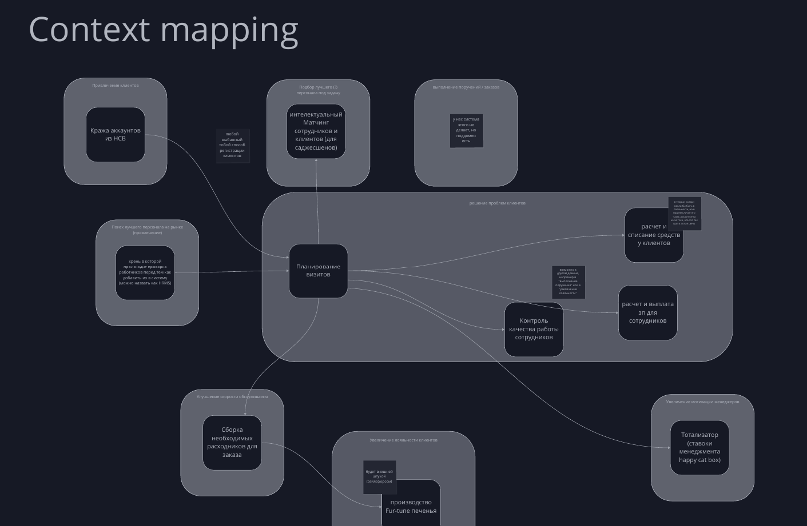
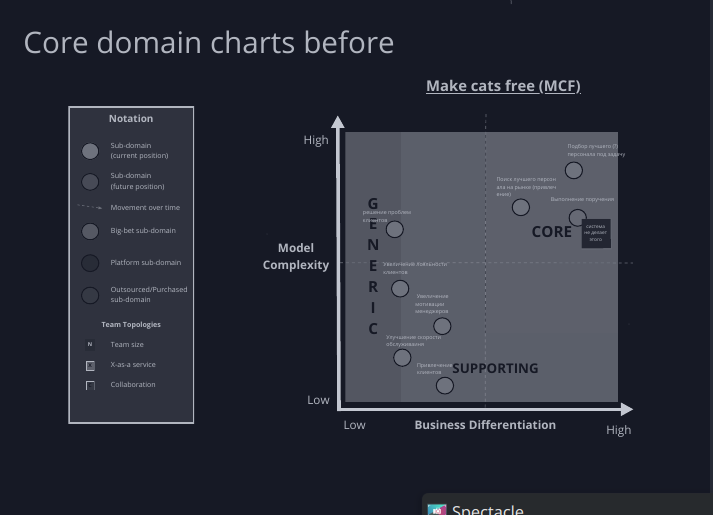

# Читы по сдаче третьей домашки
## Описать структуру системы с архитектурными стилями
За основу беру готовый вариант с контекстами и субдоменами

Основные хар-ки, из требований:

| Subdomain | Bounded Context | Characteristics | Description |
|------------|----------------|-----------------|-------------|
| Привлечение клиентов | Кража аккаунтов из НСВ | | |
| Подбор лучшего (Г) персонала под задачу | Интеллектуальный матчинг сотрудников (для садженшенов) | agility, testability и deployability, scalability и elasticity. | Удачно в прошлой домашке предположил, что если мы прем клиентов из HCB, а они там планируют расти, то и у нас клиентов станет больше. Так же важно тестить гипотезы ещё быстрее. Релизный цикл для данной части неделя, для остальной месяц, получается, лучше выделить ~~выделение~~ куда-то (я уже запутался, сервисы это услуги, а не технические сервисы, субдомены не проблемы, контексты не контексты), но куда-то точно надо выделить, потому что TTM повышенный и сложность, а ещё хотим продавать кому-то |
| Выполнение поручений / заказов | Управление исполнением заказов | | |
| Решение проблем клиентов | Планирование визитов | | |
| Решение проблем клиентов | Контроль качества работы сотрудников | Общие как и ко всей системе | |
| Решение проблем клиентов | Расчет и списание средств у клиентов | | Постоянно добавлять новые интеграции для списания средств. Не знаю значит ли это вынос в отдельную сущность, но держу в уме, что что-то такое есть |
| Решение проблем клиентов | Расчет и выплата зарплат сотрудникам | Общие требования к agility, testability, deployability | Всегда через "золоту шляпу", кусок системы не меняется |
| Поиск лучшего персонала на рынке (привлечение) | Хранилище проверки работников перед добавлением в систему (условно HRMS) | | |
| Улучшение скорости обслуживания | Сборка необходимых расходников для заказа | | |
| Увеличение лояльности клиентов | Производство Fortune-печенья | | |
| Увеличение мотивации менеджеров | Тотализатор (ставки менеджмента happy cat box) | | Менеджеры хотят об этом скрыть, поэтому выносим в отдельную сущность(чего-то там, я уже ни в чем не уверен) |

## Выбрать виды баз данных
## Выбрать стили коммуникаций
## Написать ADR
