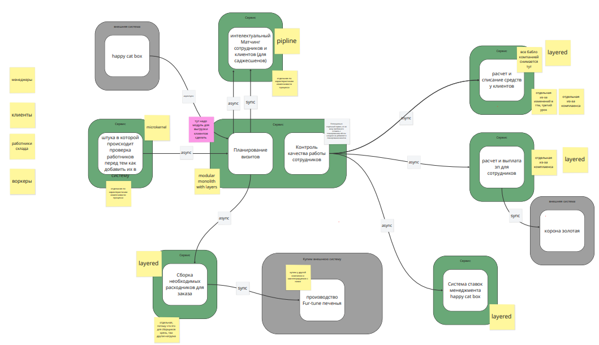
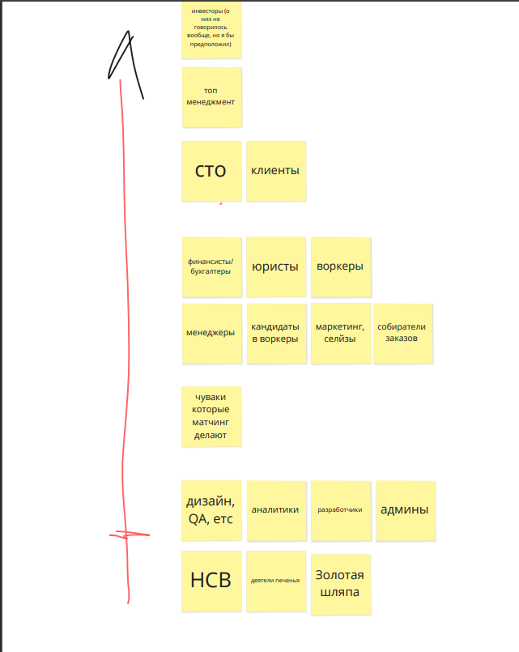

# Задачи по домашке:
## Для каждого сервиса который добавится или удалится и связанных с ним сервисов посчитайте значение instability;
взял за исходник картинку из задания

Выносим матчинг сотрудников и клиентов в отдельный сервис. Инстабилити будет 0 = 0/(0+2)
Убираем энитити сервис воркеров (у него была высокая инстабилити 4/(1+4) = 0.8)
Расчет и списание средств у сотрудников и клиентов разъедется (instability = 0/(0+2)= 0) на 2 сервиса:
- расчет и списания средств для клиентов (instability= 0/(0+1) = 0 ) и 
- расчет и выплата зп для сотрудников (instability = 1/(1+1) = 0.5)

за целевую систему беру вот этоу


## Опишите, какие сервисы и боундед-контексты в каком месте и каким образом будут меняться;
Вынос матчинга сотрудников и клинетов в отдельный сервис: происходит по причине подхождения под pipeline, а не layered monolith, плюс постоянно довольно изменчивая система, и кор-поддомен, в то время как планирование визитов и контроль качества сотрудников скорее generic или supporting

требования: 
```
скоринг потенциальных работников уникален в своём роде, и логика его работы сильно выше, чем планировалось. Бизнес в будущем хочет продавать его другим компаниям и тестировать больше гипотез;
релизный цикл для всей системы — месяц, для скоринга работников — неделя максимум.
```

Удаление энитити сервиса воркеров: в кажом боундед-контексте можно хранить только нужную информацию о воркере. Наличие отдельного энитити сервиса с высокой инстабилити ведет к инстабилити всей системы. Окак.
Раздувание таблицы, и высокая нарузка на запись как итог будет исключаться. 

Разделение списания средств на два сервиса необходимо по причине 
```
списывать деньги с клиентов каждую неделю слишком затратно для отдела, поэтому они хотят списывать деньги раз в месяц, но платить воркерам и дальше раз в месяц. При этом необходимо постоянно добавлять новые способы списания денег для клиентов. Воркеры всегда работают через компанию «Золотая шляпа»;
боятся потерять любую финансовую информацию и хотят решение, которое будет гарантировать, что всё будет ок.
```


## Спланируйте, как и в какой последовательности будет происходить работа. Сделайте два описания, для каждого из условий:
### когда есть свободные люди и ресурсы, а опыта и (или) инфраструктуры нет;
1. Вынести самую простую часть системы или создать новый функционал, чтобы обкатать инфраструктуру. 
    Тут я хз, что можно сделать в первую очередь, матчинг явно не наша цель в такой ситуации, поэтому можно потренироваться:
        a. схлопнуть энити сервис, но интуитивно кажется, что это скорее затронет сразу несколько частей сисетмы, плюс не даст опыта в обкатке инфраструктуры
        b. добавить новый сервис по списаниям с клиентов, т.к. у него изменились требования, а для воркеров осталось все так же.
2. Вынести наименее рисковую часть системы. Нууу....это явно не матчинг, поэтому будем схлопывать энтити сервис-воркеров
3. Выносим самую рисковую часть системы: матчинг воркеров и клиентов

### когда свободных людей и ресурсов нет, а опыт и (или) инфраструктура есть.
1. Если у компании есть готовая инфраструктура или команда с опытом, а ресурсов нет, значит, нужно начинать с того, что принесёт максимальный эффект при минимальных усилиях. Обычно начинают с core-поддоменов, которые не удовлетворяют характеристикам в рамках монолита. Потому что это самые важные элементы системы и приносят много денег. Логично начинать с улучшения важного.
Начинаем с самой рисковой части системы - матчинг воркеров и клиентов
2. Вторым шагом я бы выбрал схлопывание энтити сервиса воркеров, чтобы в целом уменьшить каплинг между элементами системы перед добавлением нового функционала
3. Вынос списаний с клиентов оставил бы на третий шаг, как пример добавления нового функционала. Хотя до этого думалось, что этот шаг можно выполнить 2м, т.к. несет больше юридических рисков для бизнеса и болей стейкхолдеров(бухгалтеров) и жрет деньги (слишком дорого списывать каждую неделю). А боль стейкхолдеров (те что разрабы), по схеме из предудущего урока имеют меньше влияния, чем бухгалетеры 


но остановился на этом варианте, т.к. перечитал урок и нашел палочку выручалочку:
```
Всегда начинайте с интеграций и переноса данных, потому что это самая рискованная и опасная часть любого распила.
```

Осознанно не задумывался о том как изменятся связи и каким способом выноса пользоваться для каждого сервиса. Если останется время, то дополню

## мемес
без него нельзя 

надо собираться уже


