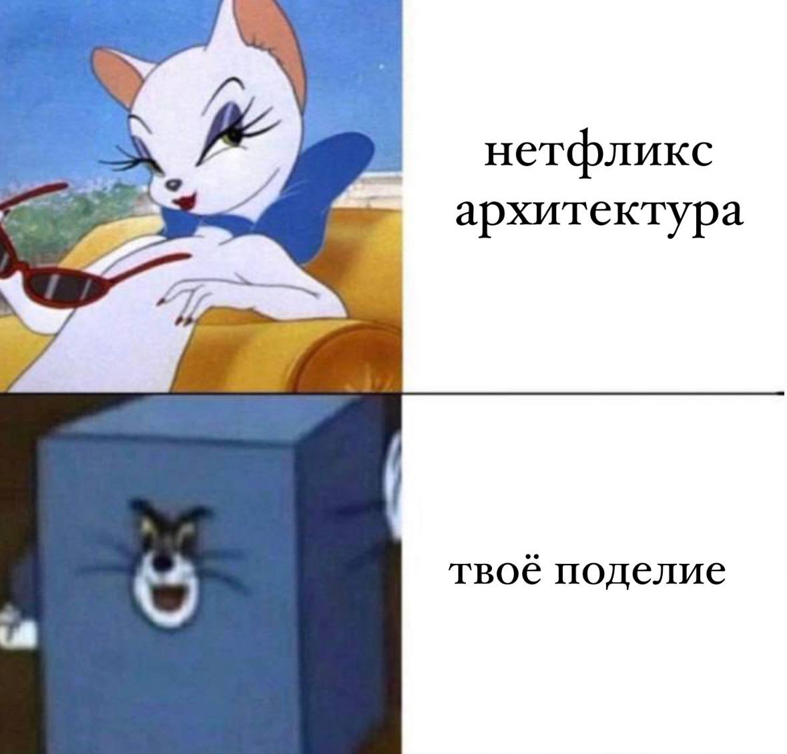
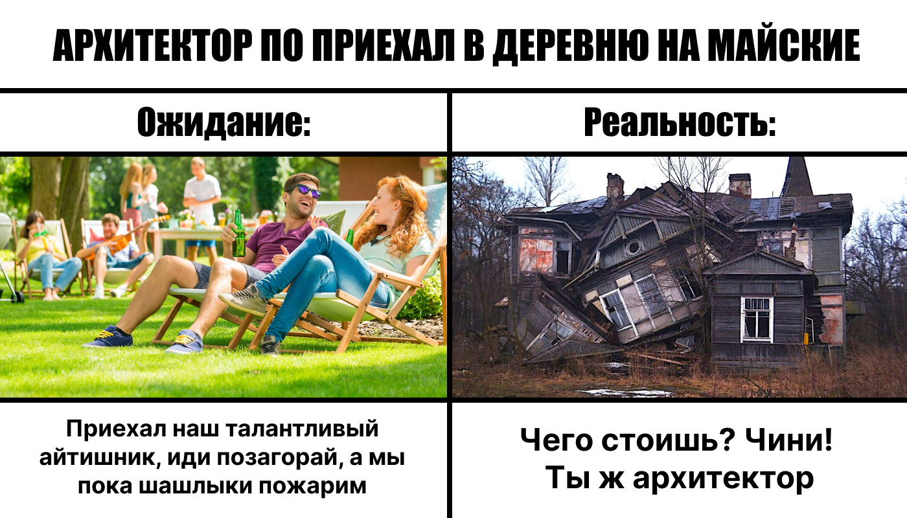

# Достать спроектированную систему из нулевой недели и сравнить её с текущим результатом. Найти места, которые вы сделали иначе, чем изначально планировали, что в текущем решении отличается от изначального и что лично вам понравилось из решений.

Хе-хе. Был сервис нотификаций, который асинхронно читал события из каждого контекста. Хотя, на схеме я его не отобразил, т.к. размышлял на тот момент контекстами, а не сервисами. Однако, это описано словами было. 

Так же сервис заказов был слишком сильно раздроблен: заказы (хз что имел в виду, наверное, какой-то энтити сервис), менеджмент услуг, менеджмент цен
Так же и матчинг: Подбор воркеров и рейтинг воркеров. 

И вот как раз раздробленность сервиса "заказы" у меня вызывала смущение, что что-то тут не так. Однако, посмотрев на тот момент домашки коллег, подумал, что я бы себе взял идею микса монолита и микросвервисов. И как раз в голове закралась мысль объединить какую-то часть системы. 

Выплаты и списания у меня были в одном сервисе, просто потому что "ну чет там с деньгами"

Из решений в финальном варианте мне нравится отсуствие энтити сервисов и сервиса нотификаций. Они явно повышают каплинг, и это мне не нравится.

Из первоначального варианта мне понравилось, что в целом система разбита по нужным сервисам за исключением некоторых деталей и огрехов. Ну если бы не было придумываний как бы ещё что разбить, а так же приколов с коммуникациями, то получилось бы на мой взгляд вполне сносно. Подработать напильником. Хотя, это на первый взгляд на свою "нулевую систему". Думаю, что если потратить дополнительное время на ее анализ, то может вылезти довольно много хреномути. Но как минимум, глядя на эту систему, я не теряюсь что с ней делать. И плюс-минус понимаю, как с этим теперь работать. 

# Выписать идеи и подходы, которые вы хотели бы внедрить в ваших рабочих или других проектах, чтобы мы могли их обсудить и подумать, как лучше всего внедрить каждую из идей или подходов.

Понравилась идея прохождения архитектурных кат с командой. Все бы лучше стали понимать контекст происходящего и начинали бы говорить на одном языке. Но в запаре на работе может не хватить времени, плюс градус повыше. А по фану вместе собираться по выходным - как будто бы у всех свои дела есть и хочется отдохнуть. Поэтому, как-то внедрить такое на работе в более легкой атмосфере - было бы полезно кмк. 

# Memes
спасибо за курс. Закрепить бы все это и не расетрять

Не уверен, что у нетфликса все хорошо, но "твое поделие" это топ

Тут главное не умететь от кринжа. Добивочный. 

